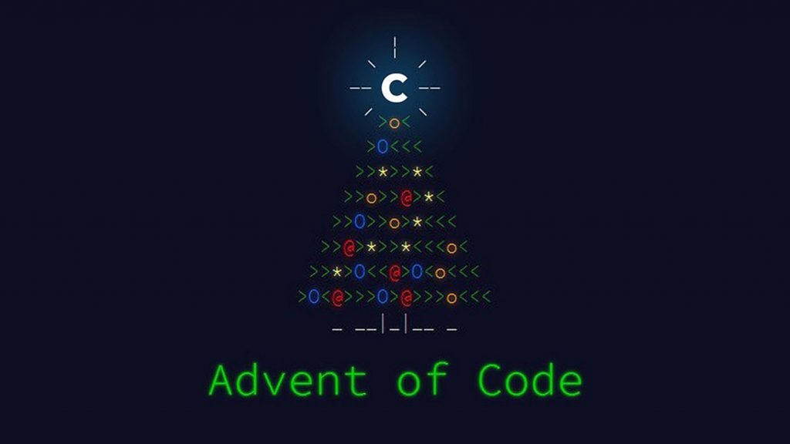

# advent-of-code

<table align="center" width="100%">
  <tr>
    <td align="center" style="padding: 10px;">
      
  </tr>
</table>
List of programming languages I want to complete AOC challenges on.

---

- 2025 - Fortran
- 2024 - Mojo 
- 2023 - Rust
- 2022 - Ada
- 2021 - Zig
- 2020 - Java
- 2019 - R
- 2018 - Go
- 2017 - C#
- 2016 - C++
- 2015 - C

---
A repository of my collection of programming and coding solutions for the annual Advent of Code event.
